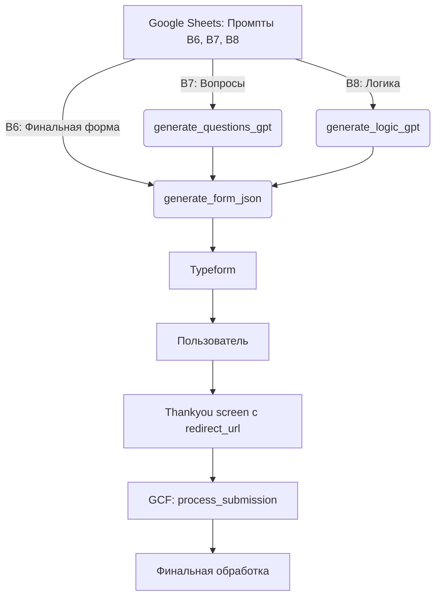

# Рефакторинг пайплайна генерации и обработки форм

## Кратко
- Полная очистка кода от устаревших функций и ручных решений
- Централизация всех промптов (B6 — финальная форма, B7 — вопросы, B8 — логика) — только из Google Sheets
- Единый механизм финального редиректа через PROCESS_SUBMISSION_URL
- creds.json добавлен в .gitignore для всех папок
- Весь пайплайн теперь чистый, расширяемый и легко поддерживаемый

## Основные изменения
- Удалены устаревшие функции генерации вопросов (текстовый формат)
- Удалён неиспользуемый и закомментированный Flask-код
- Все промпты берутся только из нужных ячеек Google Sheets (B6, B7, B8)
- Исправлены переменные для промптов в settings.py и main.py
- FINAL_REDIRECT_URL полностью заменён на PROCESS_SUBMISSION_URL
- creds.json добавлен в .gitignore для безопасности

## Архитектура пайплайна

## Для ревью
- Ветка: `refactor/cleanup-prompts-and-redirect`
- Все изменения протестированы, пайплайн работает от генерации до финальной обработки.
- Безопасность: все ключи и creds.json не попадают в репозиторий.

**Готово к слиянию!** 